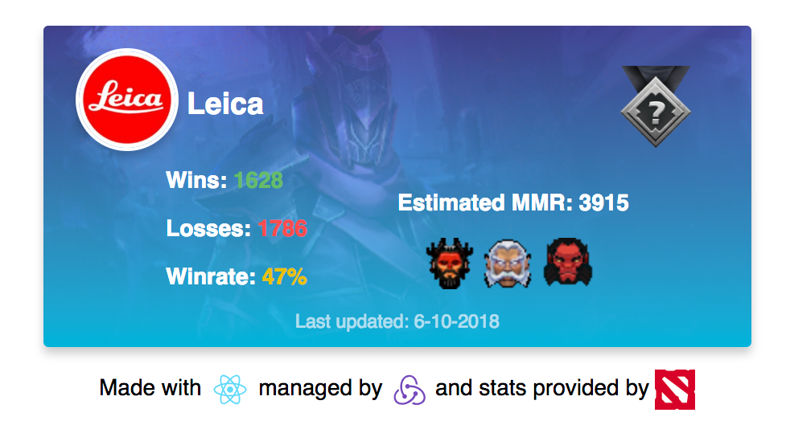

# DotaStats

_Description:_ A simple redux exercise powered by opendota
_Try it here:_ `http://acid-scene.surge.sh/`
_To use:_

- Clone the repo `git clone https://github.com/grahamplata/dotastats.git`
- `cd dotastats && npm install`
- Run `npm run start`

_Built With:_

- [React](https://www.reactjs.org/) - Component-Based JavaScript library for building user interfaces
- [Redux](https://redux.js.org/) - A predictable state container for JavaScript apps.
- [OpenDota](https://www.opendota.com/) Open source Dota 2 match data and player statistics.
